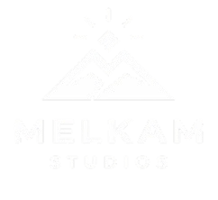

  

<h1 align="center">Melkam Engine</h1>

  <strong>A modern, lightweight C++ game engine framework inspired by the Godot architecture.</strong>

  
  
  
  
  

---

## Current Status & Roadmap

> **Note for Developers**: The **2D Engine is ready to use** and actively evolving with new features! It currently provides full 2D scene tree hierarchy, Box2D physics simulation, canvas UI system, 9-slice rendering, theme inheritance, and subpixel font engines. Work on the **3D Engine will start soon**.

## Key Features

- **Godot-Inspired Node Hierarchy**: Flexible scene tree with `Node`, `Node2D`, `CanvasItem`, and `Control` bases.
- **Type-Safe Signals & Slots**: Event-driven communication with lambda and member function slots.
- **2D Physics Engine**: Rigid bodies, character bodies (`moveAndSlide`), static colliders, and area triggers powered by Box2D.
- **Canvas UI & Theme Subsystem**: Comprehensive UI controls (`Button`, `Slider`, `OptionButton`, `ProgressBar`, `Panel`, `Label`, `TextureRect`) with Godot-style subtree theme inheritance.
- **9-Slice & Textured UI**: Dynamic border patch slicing for scalable UI cards, dialog frames, and button skins.
- **Subpixel Font Engine**: Crisp, multi-resolution TrueType font rendering with oversampled glyph packing.
- **Hardware-Accelerated 2D Renderer**: Fast batch and immediate rendering powered by SDL3.

## License

This project is open-source and licensed under the [MIT License](LICENSE) &copy; 2026 **Mickyas Tesfaye**.
